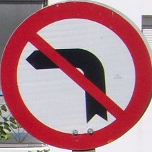
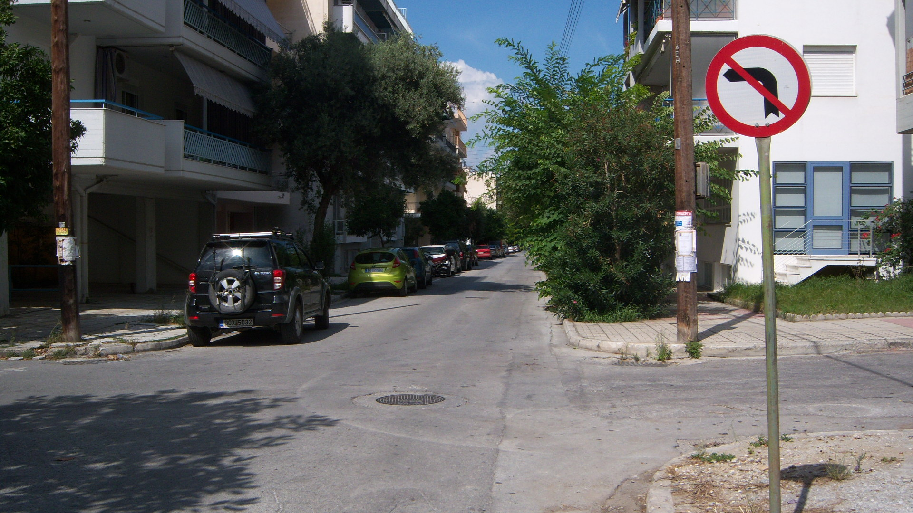
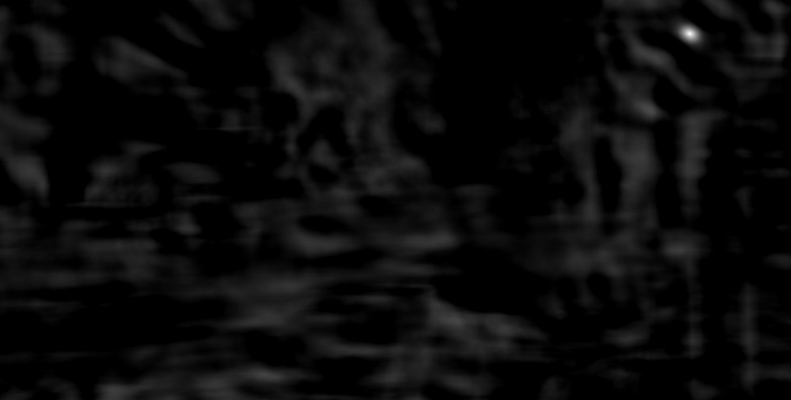
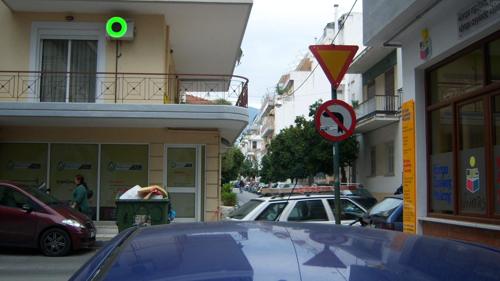
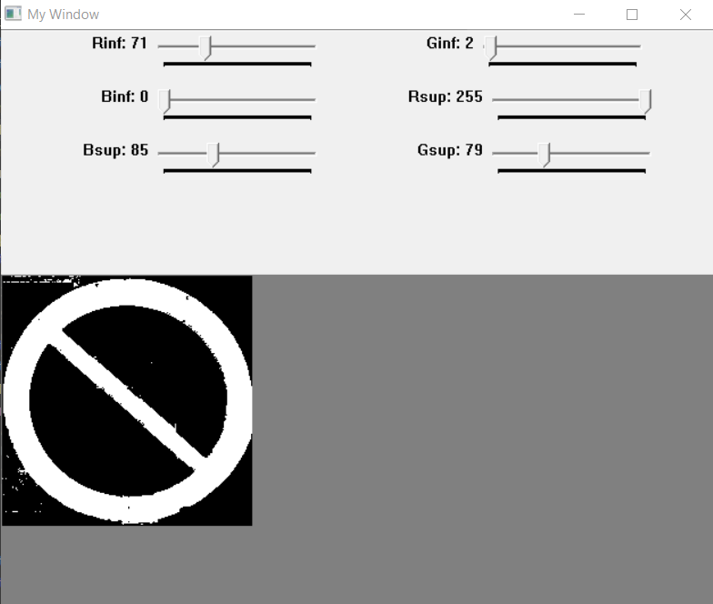
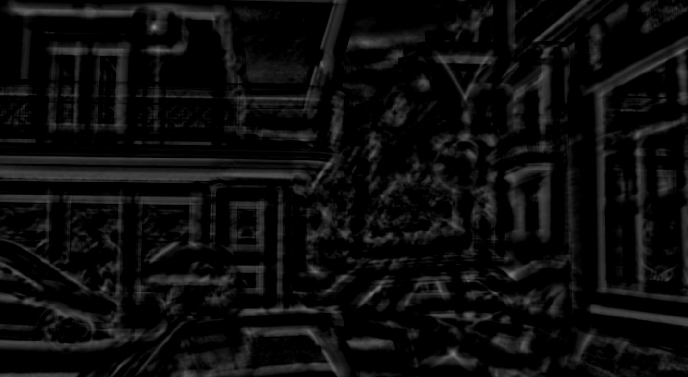
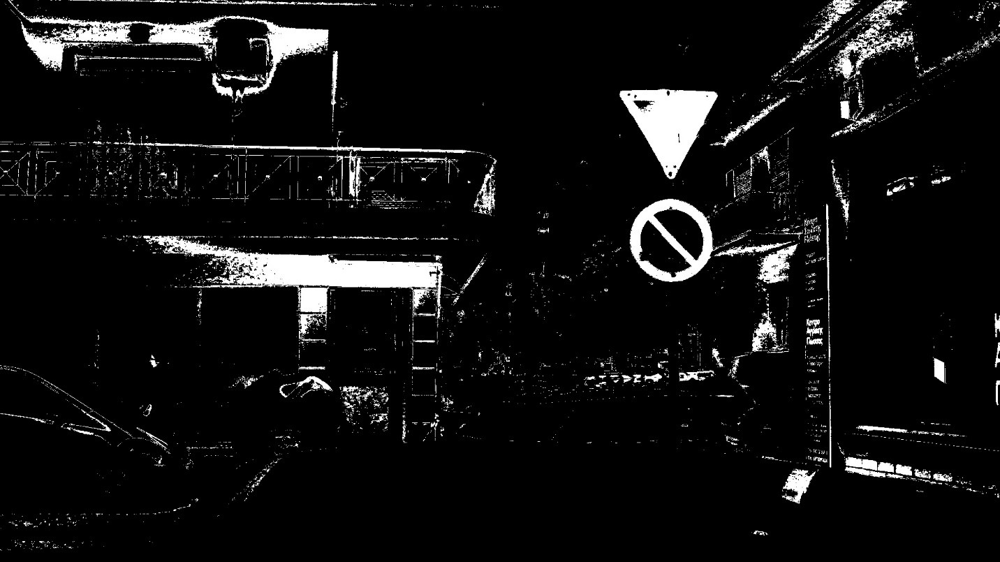
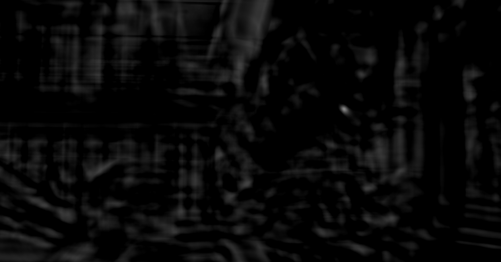

## Primeiro Exercicio Programa

## Problema

O problema resolvido nesse exercício é o reconhecimento de placas de transito de Proibido Virar utilizando técnicas de processamento de imagens dadas em sala. Para isso, foram dadas 44 fotos de ruas com placas de Proibido Virar e o programa deve destacar onde está localizada a placa. É permitido o uso de até 8 templates para guiar o programa. Como bônus, o programa informa se a placa é de Proibido Virar a Direita ou a Esquerda

## Requisitos
Para o processamento das imagens, utilizei a biblioteca [Cekeikon](http://www.lps.usp.br/hae/software/cekeikon5.html), que tem como base a biblioteca openCV, entre outras.

## Compilação

Para compilar o programa da fonte recomenda-se usar o programa "compila" que faz parte do Cekeikon. O uso é:
```
compila <nome_do_arquivo_c++> -c
```
## Uso

Para usar o programa, a sintaxe é:
```
programa <arquivo_de_entrada_com_extensao> <arquivo_de_saida_sem_extensao> <numero_de_templates>
```

O número de templates pode ser de 1 a 8, com 7 apresentando os melhores resultados. Note que o tempo de execução é alto, cerca de 2 minutos nos piores casos testados e o programa não apresenta nenhuma barra ou indicador de progresso.

## Técnicas utilizadas

A principal técnica utilizada foi o “template matching”, que consiste em procurar imagens já conhecidas, os templates, nas imagens que se deseja fazer o reconhecimento. Utilizando o OpenCV, é fácil fazer essa operação de forma simples e otimizada, apenas selecionando alguns parâmetros. O tipo de “template matching” que escolhi utilizar foi o de Correlação Cruzada Normalizada. Esse tipo permite identificar padrões até mesmo com variações de brilho e contraste entre o template e a imagem em que se faz a busca.

A função de template matching retorna uma imagem em escala de cinza, onde o ponto mais branco é o com mais probabilidade de pertencer ao template. Por exemplo, suponha-se que deseja-se procurar a seguinte placa na seguinte imagem:



A saída da função templateMatching é a seguinte:
||
|:--:|
|A região com pontos mais brilhantes indica onde há maior probabilidade da placa estar|

Para desenvolver o programa com template matching, segui um procedimento bem simples. Primeiro, olhei todas as imagens-fonte e escolhi alguns modelos de placa que serviriam de templates. Por exemplo, um bom template é uma placa de proibido virar à direita sem sujeira, outro é uma placa de virar à direita com sujeira, etc. Com isso, escolhi inicialmente 5 placas para servirem de template. 

O programa consiste em 2 loops encadeados. O primeiro loop conta de 0 ao número de templates, e a cada iteração, abre o template de número correspondente. O segundo loop então é executado para cada template. Nesse loop, o template original é transformado em um template de tamanho X pixels, pois o templateMatching é sensível a variações de tamanho. Feito o template matching, procuro pelo pixel de maior valor (mais branco) e guardo o seu valor e localização em uma matriz. Essa matriz tem como linha o número de templates e como coluna o tamanho desse template.

Após os loops terminarem, percorro a matriz com os valores dos pixels de maior valor e procuro pelo maior valor entre eles. Pego então as coordenadas desse ponto e assumo que é a localização correta da placa. Desenho um círculo de tamanho equivalente ao tamanho do template vencedor e salvo a imagem original com o círculo desenhado.

Nas primeiras tentativas, o programa conseguia acertar algumas imagens. Fui adicionando mais templates, e com isso melhorou a eficácia do programa. Entretanto, com a inclusão do 8o template, o programa teve um desempenho pior do que com 7, então mantive 7 como padrão. Apesar disso, o programa apresentava alguns erros, como na imagem a seguir


Para consertar esse tipo de erro, utilizei uma técnica de filtragem de cor. Utilizando a função inRange do OpenCV, posso especificar um intervalo de valores RGB para ser considerado. A saída é uma imagem em escala de cinza binaria. Se o pixel estiver nessa faixa, recebe o valor branco (255) e se estiver fora recebe o valor preto (0). Para descobrir qual a faixa de valor correspondente ao vermelho, criei um programa em OpenCV para que eu pudesse alterar a faixa de valores RGB e observar o resultado do filtro em tempo real.

Abrindo as várias imagens nesse programa, pude estimar uma boa faixa de valores que corresponde ao que interpretamos como vermelho. Os limites inferiores e superiores, em RGB, escolhidos são: (71,2,0) e (255,79,85).

Com esse filtro de cor, fiz uma função que, dada um pedaço da imagem, retorna a porcentagem de pixeis considerados vermelhos daquele pedaço. Assim, para determinar a posição da placa, o programa não apenas escolhe o pixel de maior valor, mas o pixel de maior valor e que possua pelo menos 20% de pixels vermelhos na área do template

Por exemplo, a imagem com erro mostrada anteriormente, tem esse resultado com template matching apenas: 

Onde é possível perceber o falso positivo dado pelo ponto brilhante no canto superior esquerdo. Porém, considerando a seguinte imagem abaixo, que é o resultado da filtragem por vermelho, percebe-se que há poucos pontos vermelhos na região do ponto brilhante de falso positivo

Assim, o programa não considera o template acima verdadeiro e procura o resultado de outros templates, levando ao resultado correto abaixo:


## Parte Bônus
Para decidir se a placa é de proibido virar à direita ou a esquerda, criei um vetor que guarda as letras D ou E. A posição desse vetor corresponde ao número do template. Eu identifiquei manualmente se o template é para a direita ou para esquerda e criei o vetor. Como eu já tinha utilizado o número do template como linha da matriz que guarda os maiores valores de pixels, basta adicionar ao programa um trecho que busca o valor da linha vencedora no vetor de “D”e “E”s e altera o nome do arquivo de saída

## Resultados Obtidos
O programa conseguiu achar as placas e cumpre os requisitos. Entretanto, o seu tempo de execução é muito alto, cerca de 60 a 110 segundos, a depender da imagem de entrada. Isso ocorre devido a necessidade do programa de rodar o templateMatching para todos os templates e para diversos tamanhos de template. Uma possível solução para melhorar a performance seria fazer algum pré-processamento na imagem, de forma a determinar o tamanho da placa. 