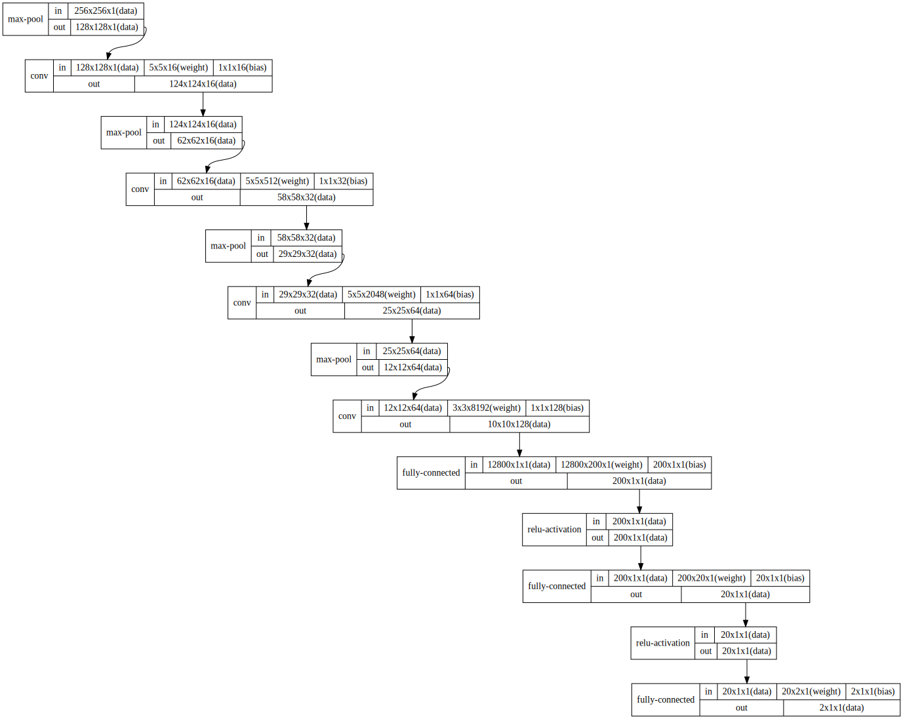

## Problema

Este exercício consiste em duas partes. A primeira parte é a classificação de rostos em duas 
categorias: masculino e feminino. A segunda parte é a classificação de rostos outras duas categorias: 
neutro e sorridente. Para ambas as classificações deve ser utilizado algum tipo de rede neural. Foi 
fornecido pelo professor um banco de dados com 400 imagens JPG, além de arquivos CSV com os nomes 
dos arquivos ao lado da sua categoria, para ser utilizado no treinamento e verificação de resultados. 
Mais detalhe sobre o problema pode ser encontrado no [enunciado](http://www.lps.usp.br/hae/psi3471/ep2-2018/ep.pdf)

## Requisitos

Para o processamento das imagens, utilizei a biblioteca [Cekeikon](http://www.lps.usp.br/hae/software/cekeikon5.html). Para o treinamento e 
aplicação da rede neural, utilizei a biblioteca [tiny dnn](https://github.com/tiny-dnn/tiny-dnn), que vem junto com a instalação do Cekeikon 5. 
Todos os programas foram utilizados apenas em plataforma Windows

## Compilação

Para compilar o programa da fonte recomenda-se usar o programa "compila" que faz parte do Cekeikon. O uso é:
```
compila <nome_do_arquivo_c++> -c -t
```

## Uso

Para usar os programas basta chamar os programas ```**_treina caminho_do_diretorio``` ou ```**_testa 
caminho_do_diretorio```. O diretório deve conter as imagens e os arquivos csv, nomeados corretamente. Pode 
também chamar com o parâmetro –v
```
**_treina –v caminho_do_diretorio
``` 
Para ativar o modo verbose, em que o programa vai imprimindo as várias etapas.

## Técnicas utilizadas
A abordagem para resolver esse problema foi a utilização de redes neurais convolucionais. 
Esse tipo de rede neural inclui algumas camadas de convolução e é a arquitetura de rede muito utilizada no processamento de imagens. Isso ocorre porque a convolução mostra uma forte relação do pixel 
analisado com os seus vizinhos mais próximos, de forma semelhante ao modo como podemos interpretar uma imagem. 

A rede convolucional inclui, usualmente, camadas de pooling. Uma camada de pooling é uma 
camada que serve para reduzir a resolução após uma etapa de convolução. Essa camada determina o 
valor de um pixel de saída utilizando uma janela de pixeis de entrada. O método utilizado nesse exemplo 
foi apenas o de max pooling, que consiste no pixel de saída ter o valor do maior pixel da janela.

## Classificação Masculino/Feminino

Para a classificação Masculino/Feminino testei várias configurações de redes neurais convolucionais. A maior parte dos modelos testados, pode ser encontrado na pasta modelos, assim como a análise do desempenho. O diagrama a seguir representa o modelo final escolhido. 

|  |
|:--:| 
|*Figura 1: Diagrama do modelo final testado*|

Os resultados desse modelo foram bem satisfatórios, atingindo acurácia de 98% na validação e 99% no teste.

## Classificação Neutro/Sorridente

Para a classificação Neutro/Sorridente usei a mesma arquitetura da classificação Masculino/Feminino e obtive resultados satisfatórios. Com 10 epochs acertou 96% da validação e 94% do teste.
